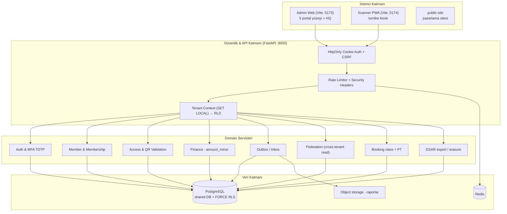
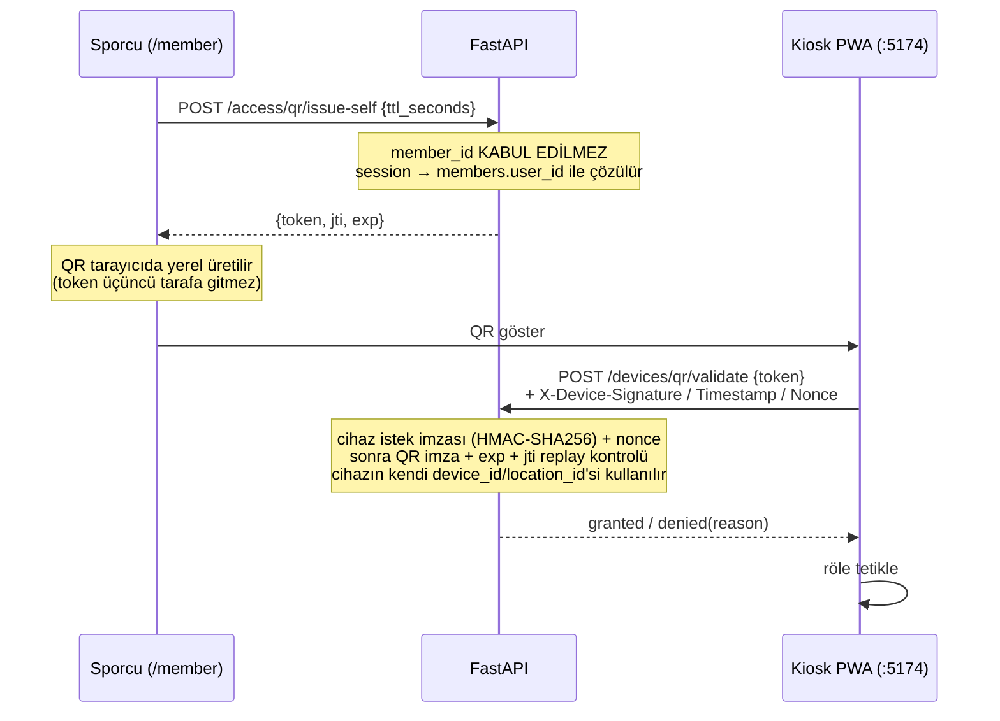
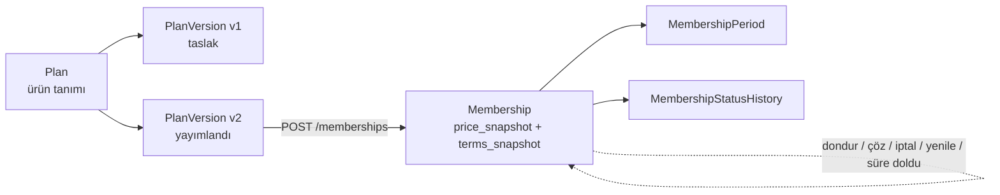
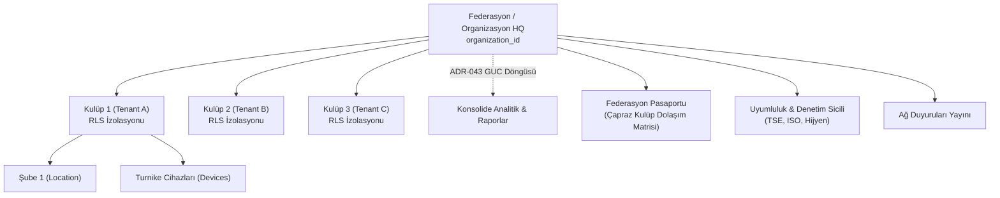
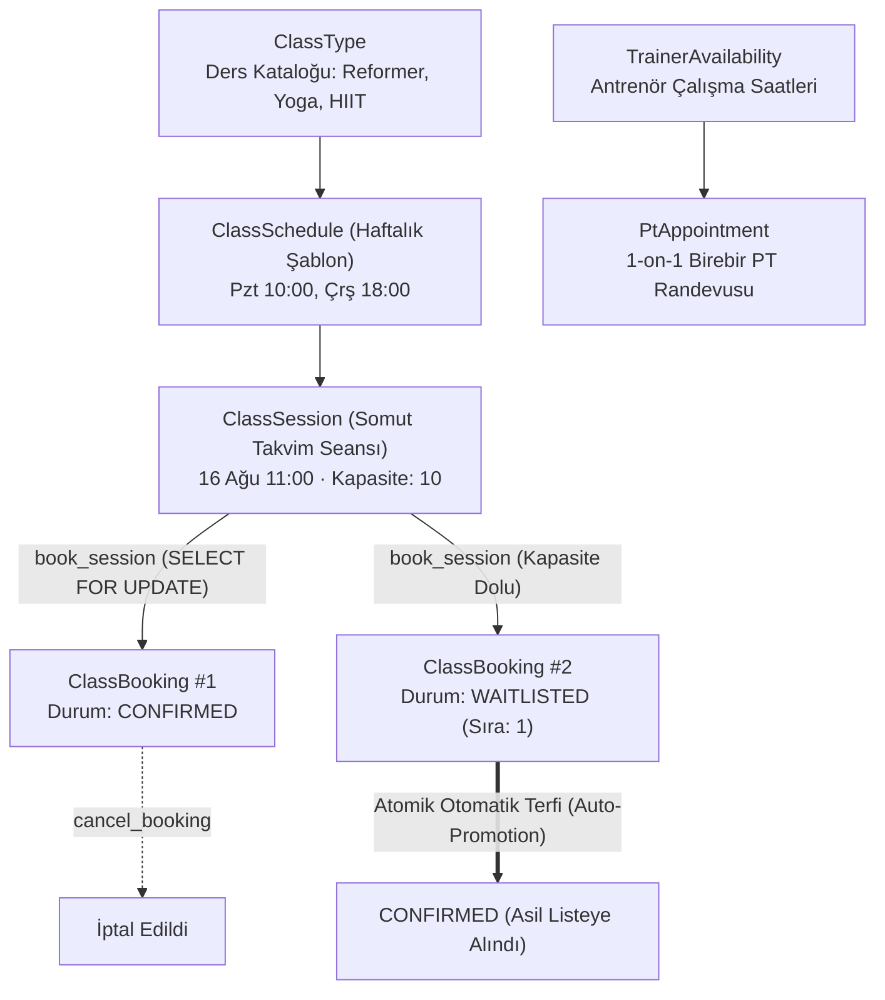

# GymClubNex (Fitness Network OS) — Sistem Mimarisi

**Son güncelleme:** 2026-08-16  
**Last code:** `48b3c79` (`main`, PR **#95**) · Alembic `xi0d1e2f3a4b`  
**Production-ready?** **NO** · Phase 26 PASS? **NO / NOT VERIFIED**  
**Sözleşme:** `docs/MASTER_SPEC.md` + `docs/PRODUCTION_READINESS.md`  
**Kapanan kampanya (tekrar etme):** `docs/CAMPAIGN_REGISTER.md`  
**Pickup:** `docs/HANDOFF.md`

Bu dosya *nasıl durduğunu* anlatır. Kod nerede diye `.codesight/wiki/index.md`
oku; değiştirmeden önce kaynağı oku.

**İlgili:** `AGENTS.md` · `docs/RBAC.md` · `docs/adr/` (ADR-043, ADR-044)

---

## 1. Genel sistem bakışı

`public-site` bağımsız bir pazarlama uygulamasıdır; API'ye bağlı değildir ve
portal modelinin parçası değildir.

---

## 2. Rol → Portal haritası

Platformda **11 kanonik rol** (`backend/permissions.yml`) ve **5 portal yüzeyi**
vardır. İkisi bire bir değildir — aşağıdaki tablo gerçek eşlemedir.

| Portal | Rota | Erişebilen roller | İşlev |
|---|---|---|---|
| Federasyon Konsolu | `/superadmin` | `PLATFORM_SUPER_ADMIN`, `FEDERATION_ADMIN`, `FEDERATION_ANALYST`, `FEDERATION_SUPPORT` | Organizasyon/kulüp dizini, tenant başına metrikler, sistem audit kayıtları, tenant'a geçiş, pasaport kuralları, uyumluluk sicili ve ağ duyuruları |
| Kulüp Operasyon Konsolu | `/` (+ `/classes`, `/members`, `/locations`, `/finance`) | `GYM_OWNER`, `GYM_ADMIN`, `GYM_MANAGER`, `ACCOUNTANT`, `FRONT_DESK` | Üye kaydı, abonelik, şube, finans, ders programı takvimi ve yoklama çekmecesi |
| Antrenör Portalı | `/trainer` | `TRAINER` (+ `GYM_OWNER`, `GYM_ADMIN`) | Atanmış üyeler, turnike giriş geçmişi, hak kontrolü, grup dersleri ve 1-on-1 PT seansları canlı yoklama defteri |
| Sporcu Portalı | `/member` | `MEMBER` | Üyelik/hak durumu, 60 sn'lik tek kullanımlık giriş QR'ı, grup dersi rezervasyonu (yedek sırası) ve birebir PT randevusu alma |
| Kapı Okuyucu PWA | `:5174` (ayrı uygulama) | *cihaz principal'ı* — kullanıcı rolü değil | QR doğrulama, hak düşümü, röle tetikleme |

**Giriş kapısı:** `/portal` — oturum açmış kullanıcıya yalnızca **kendi
rollerinin açtığı** kartları gösterir. Rol yoksa boş durum gösterir.

**Rota alias'ları:** `/federation` → `/superadmin`, `/athlete` → `/member`,
`/home` → `/portal`.

**Yönlendirme:** Login sonrası `homeRouteFor()`
(`frontend/admin-web/src/auth/roles.ts`) kullanıcıyı en geniş yetkili portalına
gönderir.

### Yetkilendirme nerede uygulanır

Rol ayrımı üç katmanda birden zorunludur; hiçbiri tek başına yeterli sayılmaz:

1. **Frontend** — `RequireAuth` (sunucudan doğrulanmış oturum, `GET /me/session`)
   + `RequireRole`. Bu yalnızca **kullanılabilirlik** katmanıdır, güvenlik sınırı değildir.
2. **API** — her handler `AuthorizationService.require_tenant` / `require_self`
   ile izin kontrolü yapar. Gerçek yetki sınırı burasıdır.
3. **Veritabanı** — RLS politikaları (`FORCE ROW LEVEL SECURITY`) tenant
   sızıntısını yapısal olarak imkânsız kılar.

---

## 3. Tenant izolasyonu

- Her tenant'a ait tablo: `tenant_id` (NOT NULL) + index + `UNIQUE(tenant_id, id)` + RLS politikası. CI kapısı: `scripts/check_tenancy.py`.
- Politika: `tenant_id = nullif(current_setting('app.current_tenant_id', true), '')::uuid`, `FORCE ROW LEVEL SECURITY` ile tablo sahibi de muaf değil.
- Context **transaction-scoped** (`SET LOCAL`), `after_begin` listener'ı ile commit sonrası yeniden kurulur (`app/db/session.py`).
- Context boşsa sorgu **sıfır satır** döner (fail-closed).

**RLS'siz kalan tablolar ve gerekçesi**

| Tablo | Gerekçe |
|---|---|
| `tenants`, `organizations` | Tenant bariyerinin *üstünde* — dizin verisi |
| `users`, `user_sessions` | Kimlik doğrulama artefaktı; tenant'a ait değil |
| `device_sessions` | Tenant'ı *türeten* bootstrap okuması; policy burada her cihaz isteğini kapatırdı. Tek pre-context okuma budur — `devices` ve `device_nonces` context kurulduktan sonra, tam RLS altında okunur |

### Cross-tenant okuma

Federasyon agregaları RLS'i genişletmez. Tenant listesi sayfalanır ve her
tenant için GUC tek tek kurularak salt-okunur sorgu yapılır — her SQL ifadesi
hâlâ tek bir tenant görür. Karar ve reddedilen alternatifler:
**`docs/adr/ADR-043-federation-scope-reads.md`**.

`is_superuser` bir federasyon yetkisi değil, **tenant taklit bayrağıdır**:
sahibi `X-Tenant-ID` ile herhangi bir tenant'ı adresleyebilir. Bu erişim artık
`superuser.tenant_impersonation` audit olayı yazar.

---

## 4. QR erişim akışı

- Üye kendi adına QR üretir; başkası adına üretemez (istek şemasında alan yok).
- Personel yolu ayrıdır: `POST /access/qr/issue` + `access:issue` izni.
- Aynı token ikinci kez taranırsa `replay` ile reddedilir.
- Kiosk çevrimdışıyken **deny-by-default** uygular.
- Cihaz kimliği iki parçadır: `device_session` cookie'si **ve** `POST /devices/auth`
  yanıtında bir kez verilen imza sırrı (cookie'de taşınmaz; veritabanında `fernet:hmac:` ile şifrelenir). Her istek
  `METHOD\npath\ntimestamp\nnonce\nsha256(body)` üzerinden HMAC-SHA256 ile
  imzalanır; ±300 sn saat toleransı, nonce tek kullanımlıktır (`device_nonces`).
  Çalınan cookie tek başına yetmez, yakalanan imzalı istek tekrar oynatılamaz.
  Karar ve reddedilen alternatifler: **`docs/adr/ADR-044-device-request-signing.md`**.

---

## 5. Üyelik ve plan alanı

Bir abonelik daima **yayımlanmış bir plan sürümüne** karşı satılır. Katalog ile
abonelik arasındaki sınır kasıtlıdır: fiyat, ürün tanımında değil, satış anında
aboneliğe **kopyalanır**.

Kurallar ve gerekçeleri:

- **Sürüm numarası sunucuda atanır** (`create_plan_version`). İstemciden gelse
  aynı anda taslak açan iki operatör aynı numarayı isteyebilir ve biri
  diğerinin yerini sessizce alırdı.
- **Yayımlama tek yönlüdür.** Yayımlanmış sürüm düzenlenemez, geri alınamaz —
  satılmış abonelikler o fiyata bağlıdır. Fiyat değişikliği = yeni sürüm.
- **Taslak satılamaz.** `start_membership` yalnızca `is_published` sürümü kabul
  eder, aksi hâlde 400 döner.
- **Fiyat anlık kopyalanır** (`price_snapshot`, `price_snapshot_currency`,
  `terms_snapshot`). Sonraki bir sürüm geçmişi yeniden yazamaz.
- **Bir üyede tek canlı abonelik.** `ACTIVE / FROZEN / PAST_DUE / SCHEDULED /
  PENDING` durumlarından biri varsa ikinci başlatma reddedilir.
- **Para uçtan uca tam sayı kuruştur** (`amount_minor`). UI'daki `499,90`
  girdisi float'tan geçmeden basamak ayrıştırmasıyla `49990`'a çevrilir; ORM'de
  float para alanı CI tarafından bloke edilir (`check_no_money_floats.py`).
- Yetki: katalog ve abonelik başlatma `memberships:read` / `memberships:write`
  izinlerini kullanır. Ayrı bir `plans:*` çifti eklenmedi — aynı şeyi söyleyen
  ikinci bir izin matrisi göç gerektirirdi.

Gelecek durumlar (`SCHEDULED`) `start_date` geleceğe verildiğinde servis
tarafından seçilir; istemci durum gönderemez.

---

## 6. Federasyon ve Çoklu Kulüp Ağı (HQ) Mimarisi

Federasyon, münferit kulüplerin (tenant) üstünde yer alan organizasyon/franchise çatı yapısıdır.

Kurallar ve Tasarım İlkeleri:
- **Federation != Tenant; Gym = Tenant:** Kulüp düzeyindeki tüm veriler (üyeler, turnike geçişleri, ödemeler, kasalar) PostgreSQL RLS (`tenant_id`) ile kesin olarak yalıtılmıştır.
- **ADR-043 Çapraz Kulüp Okuma Güvencesi:** Federasyon okumaları RLS politikalarını gevşetmez veya RLS-bypass rolleri kullanmaz. `FederationService`, her bir tenant için sırayla `SET LOCAL app.current_tenant_id = :id` GUC'unu kurar, sayfa tavanı (`MAX_TENANT_PAGE = 50`) uygular ve `_leave_tenant()` ile temizler. Sayfa sınırını aşan durumlarda `partial: true` bayrağı döner.
- **Kulüp Yaşam Döngüsü & Askıya Alma:** Federasyon yöneticisi bir kulübü gerekçe belirterek anında `SUSPENDED` durumuna alabilir. Askıya alınan kulübün hem insan girişleri hem de turnike tarayıcı cihaz yetkileri (`deps.py:_verify_tenant_status`) kesilir.
- **Federasyon Pasaportu & Mahsuplaşma:** `passport_configs` tablosu üzerinden hangi kulübün hangi üyelik paket seviyelerini (VIP, Gold vb.) misafir olarak kabul edeceği, aylık geçiş kotası ve ziyaret başı mahsuplaşma ücreti (`guest_fee_minor`) yönetilir.
- **Uyumluluk & Muayene Sicili:** `compliance_records` ile kulüplerin resmi TSE/ISO/Hijyen denetim kayıtları merkezi olarak tutulur.
- **Ağ Duyuruları:** `network_alerts` ile tüm ağa veya belirli bir kulübün paneline doğrudan uyarı/duyuru broadcast edilir.

---

## 7. Grup Dersi & Birebir PT Rezervasyon Motoru (B1)

Grup ders seansları, şablon programlar, kapasite kotaları, dinamik yedek sırası ve 1-on-1 Personal Training (PT) randevu motoru mimarisidir.

### Temel Prensipler ve Concurrency Güvenceleri:
1. **Pessimistik Kilitleme (`SELECT ... FOR UPDATE`):** `ClassBookingService.book_session` ve `cancel_booking` çağrılarında hedef `class_sessions` satırı PostgreSQL üzerinde kilitlenir (`with_for_update()`). Eşzamanlı 10 rezervasyon burst denemesinde kapasite kesinlikle aşılmaz (sıfır overbooking).
2. **Kapasite ve Dinamik Yedek Sırası (FIFO Waitlist):**
   - Doluluk < Kapasite ise kayıt `CONFIRMED` olarak oluşturulur ve `class.booking_confirmed.v1` eventi yayınlanır.
   - Doluluk >= Kapasite ise kayıt `WAITLISTED` durumuna alınır, ardışık kuyruk numarası (`waitlist_position = 1..N`) verilir ve `class.booking_waitlisted.v1` eventi yayınlanır.
   - Kısmi tekil indeks (`uq_class_bookings_active_member`), üyenin aynı derse mükerrer aktif kayıt yapmasını veritabanı seviyesinde bloke eder.
3. **Otomatik Asil Listeye Terfi (`Auto-Promotion`):**
   - Asil listedeki bir üye rezervasyonunu iptal ettiğinde (`cancel_booking`), 1. sıradaki yedek (`waitlist_position = 1`) anında `CONFIRMED` statüsüne yükseltilir, `waitlist_position` alanı temizlenir ve `class.booking_promoted.v1` eventi üretilir.
   - Kalan tüm yedek üyelerin sıraları (`2..N`) tek bir atomik sorguyla kaydırılır (`waitlist_position = waitlist_position - 1`).
4. **Geç İptal Eşiği (`Cancellation Cutoff Window`):** Seans başlangıcına `cancellation_cutoff_minutes` süresinden daha az kalmışsa iptal işlemi `is_late_cancellation = True` olarak işaretlenir; kulüp no-show/hak yakma politikalarını işletebilir.
5. **Antrenör Çakışma Önleme (PT):** `book_appointment` çakışmayı önce SELECT ile bakar, insert `flush` eder. Eşzamanlı ilk insert'te `FOR UPDATE` + EXCLUDE deadlock verdiği için **PT insert yolunda `FOR UPDATE` yoktur**; çift rezervasyonu PostgreSQL `btree_gist` `ex_pt_appointments_no_overlap` (Alembic `xi0d1e2f3a4b`) ve `IntegrityError` → `409` tutar. İptal hâlâ satırı `FOR UPDATE` ile kilitler. `ExcludeConstraint` ORM'de yoktur (SQLite `create_all` kırılır); `env.py` bu constraint'i autogenerate'den düşürür.
6. **PostgreSQL RLS & Composite FK:** 6 tablo (`class_types`, `class_schedules`, `class_sessions`, `class_bookings`, `trainer_availabilities`, `pt_appointments`) `TenantMixin` ve PostgreSQL RLS ile yalıtılmıştır.

---

## 8. Üretim runtime (compose) — landed, tekrar yazma

`docker-compose.prod.yml` tek süreç değil. `x-runtime-env` paylaşılır;
ayrıcalıklı migrator DSN yalnız migrate servisindedir.

| Servis | `COMPONENT_NAME` | Rol |
|---|---|---|
| `migrate` | `migrate` | One-shot Alembic. Tek `MIGRATOR_DATABASE_URL` sahibi. |
| `web` | `web` | FastAPI. Uygulama DSN; migrator DSN yok. |
| `outbox-worker` / `notification-worker` | `worker` | Outbox + e-posta. `PRODUCTION_PRIVATE_NETWORK` paylaşır. |
| `admin-web` / `scanner-pwa` | — | SPA image + nginx. |

Kurallar (`Settings.validate_production()`, `alembic/env.py`):

- Üretimde DB/Redis TLS (`sslmode=require|verify-full`, `rediss://`) **veya**
  `PRODUCTION_PRIVATE_NETWORK=1`. Aksi fail-closed.
- CORS origin'leri `https://`.
- `MIGRATOR_DATABASE_URL` `COMPONENT_NAME=migrate` dışında yasak.
- IsolationProvider somutlaştırılmaz. `Scope.LOCATION` açılmaz.

Haftalık kanıt: `.github/workflows/ops-drills.yml` (dump/restore, PITR, S3
MinIO, TLS smoke, alert). Tip `1b42ab4` run `31968740247` SUCCESS. Bu
üretim AWS / off-host WAL / gerçek pager değildir.

---

## 9. Bilinen açık maddeler

Bu bölüm doküman ile gerçeğin ayrışmasını önlemek içindir.
Kapanan in-repo ID'ler: `docs/CAMPAIGN_REGISTER.md`.

**Bilinçli tasarım (açık değil):**

- `device_sessions` tablosunda RLS yok (yukarıdaki gerekçe).
- Ağır federasyon analitiği için rollup tablosu yok (ADR-043 yol 3, ertelendi).
- Login rate limit Redis düşünce süreç-içi pencereye düşer — çok süreçte limit
  çarpılır. Bilinçli fail-open; `rate_limit.redis_*` loglanır.
- IsolationProvider abstraction durur — icat etme. `Scope.LOCATION` ertelendi.

**Kodda landed, üretim kanıtı ayrı:**

- Rapor storage S3 API'sine karşı **MinIO 10/10** (`docs/ops/S3_RUNTIME_PROOF.md`).
  **AWS kova + IAM hâlâ UNVERIFIED** (P1-3b-PROD / P2-3-IAM).
- QR sırları: üretim `kms:enc:` / `fernet:hmac:`; yerel `local:hmac:`.
  Canlı KMS alias rotate edilmedi.
- `/metrics` + yerel Prometheus / Alertmanager / Grafana + null-receiver drill
  landed (`docs/ops/OBSERVABILITY.md`). Gerçek pager + tracing UNVERIFIED.
- Lokal dump/restore + PITR geçti (`docs/ops/DR_RESTORE_STATUS.md`).
  Off-host WAL / ölçülmüş RPO UNVERIFIED.
- Privileged MFA, invite (`account_invites` / `INVITE-OTP`), DSAR export+erasure,
  scanner HMAC (ADR-044) kodda.

**İnsan / dış kapı (ajan kapatamaz):**

- HAND-1 tarayıcı imzası boş.
- P1-11 bağımsız pentest yok.
- KVKK / LICENSE / live HA UNVERIFIED.
- Phase 26 çıkış kapısı **geçilmedi**. Canlı yayın **NO-GO**.
