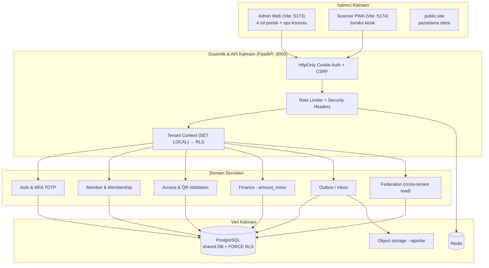
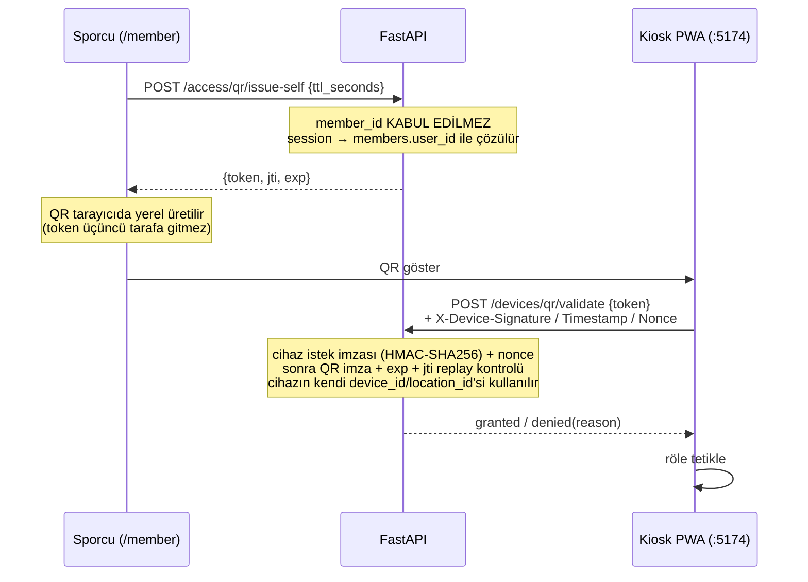

# GymClubNex (Fitness Network OS) — Sistem Mimarisi

**Son güncelleme:** 2026-08-12
**Kaynak:** Bu doküman `~/.gemini/antigravity-cli/brain/` altında, git dışında tutulan
bir taslaktan repo'ya taşındı ve koda karşı doğrulanarak düzeltildi. Mimari
doküman artık yalnızca burada yaşar.

**İlgili:** `AGENTS.md` (kurallar) · `docs/MASTER_SPEC.md` (gereksinimler) ·
`docs/RBAC.md` (yetki matrisi) · `docs/adr/` (mimari kararlar)

---

## 1. Genel sistem bakışı

`public-site` bağımsız bir pazarlama uygulamasıdır; API'ye bağlı değildir ve
portal modelinin parçası değildir.

---

## 2. Rol → Portal haritası

Platformda **11 kanonik rol** (`backend/permissions.yml`) ve **5 portal yüzeyi**
vardır. İkisi bire bir değildir — aşağıdaki tablo gerçek eşlemedir.

| Portal | Rota | Erişebilen roller | İşlev |
|---|---|---|---|
| Federasyon Konsolu | `/superadmin` | `PLATFORM_SUPER_ADMIN`, `FEDERATION_ADMIN`, `FEDERATION_ANALYST`, `FEDERATION_SUPPORT` | Organizasyon/kulüp dizini, tenant başına metrikler, sistem audit kayıtları, tenant'a geçiş |
| Kulüp Operasyon Konsolu | `/` (+ `/members`, `/locations`, `/finance`) | `GYM_OWNER`, `GYM_ADMIN`, `GYM_MANAGER`, `ACCOUNTANT`, `FRONT_DESK` | Üye kaydı, abonelik, şube, finans |
| Antrenör Portalı | `/trainer` | `TRAINER` (+ `GYM_OWNER`, `GYM_ADMIN`) | Atanmış üyeler, turnike giriş geçmişi, hak kontrolü |
| Sporcu Portalı | `/member` | `MEMBER` | Üyelik/hak durumu, 60 sn'lik tek kullanımlık giriş QR'ı |
| Kapı Okuyucu PWA | `:5174` (ayrı uygulama) | *cihaz principal'ı* — kullanıcı rolü değil | QR doğrulama, hak düşümü, röle tetikleme |

**Giriş kapısı:** `/portal` — oturum açmış kullanıcıya yalnızca **kendi
rollerinin açtığı** kartları gösterir. Rol yoksa boş durum gösterir.

**Rota alias'ları:** `/federation` → `/superadmin`, `/athlete` → `/member`,
`/home` → `/portal`.

**Yönlendirme:** Login sonrası `homeRouteFor()`
(`frontend/admin-web/src/auth/roles.ts`) kullanıcıyı en geniş yetkili portalına
gönderir.

### Yetkilendirme nerede uygulanır

Rol ayrımı üç katmanda birden zorunludur; hiçbiri tek başına yeterli sayılmaz:

1. **Frontend** — `RequireAuth` (sunucudan doğrulanmış oturum, `GET /me/session`)
   + `RequireRole`. Bu yalnızca **kullanılabilirlik** katmanıdır, güvenlik sınırı değildir.
2. **API** — her handler `AuthorizationService.require_tenant` / `require_self`
   ile izin kontrolü yapar. Gerçek yetki sınırı burasıdır.
3. **Veritabanı** — RLS politikaları (`FORCE ROW LEVEL SECURITY`) tenant
   sızıntısını yapısal olarak imkânsız kılar.

---

## 3. Tenant izolasyonu

- Her tenant'a ait tablo: `tenant_id` (NOT NULL) + index + `UNIQUE(tenant_id, id)` + RLS politikası. CI kapısı: `scripts/check_tenancy.py`.
- Politika: `tenant_id = nullif(current_setting('app.current_tenant_id', true), '')::uuid`, `FORCE ROW LEVEL SECURITY` ile tablo sahibi de muaf değil.
- Context **transaction-scoped** (`SET LOCAL`), `after_begin` listener'ı ile commit sonrası yeniden kurulur (`app/db/session.py`).
- Context boşsa sorgu **sıfır satır** döner (fail-closed).

**RLS'siz kalan tablolar ve gerekçesi**

| Tablo | Gerekçe |
|---|---|
| `tenants`, `organizations` | Tenant bariyerinin *üstünde* — dizin verisi |
| `users`, `user_sessions` | Kimlik doğrulama artefaktı; tenant'a ait değil |
| `device_sessions` | Tenant'ı *türeten* bootstrap okuması; policy burada her cihaz isteğini kapatırdı. Tek pre-context okuma budur — `devices` ve `device_nonces` context kurulduktan sonra, tam RLS altında okunur |

### Cross-tenant okuma

Federasyon agregaları RLS'i genişletmez. Tenant listesi sayfalanır ve her
tenant için GUC tek tek kurularak salt-okunur sorgu yapılır — her SQL ifadesi
hâlâ tek bir tenant görür. Karar ve reddedilen alternatifler:
**`docs/adr/ADR-043-federation-scope-reads.md`**.

`is_superuser` bir federasyon yetkisi değil, **tenant taklit bayrağıdır**:
sahibi `X-Tenant-ID` ile herhangi bir tenant'ı adresleyebilir. Bu erişim artık
`superuser.tenant_impersonation` audit olayı yazar.

---

## 4. QR erişim akışı

- Üye kendi adına QR üretir; başkası adına üretemez (istek şemasında alan yok).
- Personel yolu ayrıdır: `POST /access/qr/issue` + `access:issue` izni.
- Aynı token ikinci kez taranırsa `replay` ile reddedilir.
- Kiosk çevrimdışıyken **deny-by-default** uygular.
- Cihaz kimliği iki parçadır: `device_session` cookie'si **ve** `POST /devices/auth`
  yanıtında bir kez verilen imza sırrı (cookie'de taşınmaz). Her istek
  `METHOD\npath\ntimestamp\nnonce\nsha256(body)` üzerinden HMAC-SHA256 ile
  imzalanır; ±300 sn saat toleransı, nonce tek kullanımlıktır (`device_nonces`).
  Çalınan cookie tek başına yetmez, yakalanan imzalı istek tekrar oynatılamaz.
  Karar ve reddedilen alternatifler: **`docs/adr/ADR-044-device-request-signing.md`**.

---

## 5. Bilinen açık maddeler

Bu bölüm doküman ile gerçeğin ayrışmasını önlemek içindir.

- `device_sessions` tablosunda RLS yok (yukarıdaki gerekçe — bilinçli tasarım).
- Ağır federasyon analitiği için rollup tablosu henüz yok (ADR-043 yol 3, ertelendi).
- Login rate limit normalde Redis'te ortak pencere kullanır; **Redis erişilemezse
  süreç-içi pencereye düşer** — yani çok süreçli kurulumda limit süreç sayısı kadar
  çarpılır. Bilinçli fail-open (login cache kesintisinde kapanmasın), `rate_limit.redis_*`
  uyarısıyla loglanır.
- Phase 26 çıkış kapısı **geçilmedi**: dış pentest kanıtı yok.
